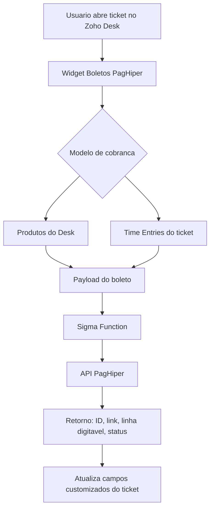

# Boletos PagHiper para Zoho Desk

<p align="center">
  
</p>

Extensao para Zoho Desk que permite emitir, consultar e cancelar boletos PagHiper diretamente no painel lateral do ticket.

O widget foi criado para cenarios de atendimento, suporte e faturamento em que a equipe precisa transformar produtos do catalogo ou lancamentos de horas do ticket em uma cobranca por boleto, sem sair do Zoho Desk.

## Status do projeto

O projeto esta em estado funcional/publicavel como MVP:

- Emissao de boleto PagHiper a partir de produtos do Zoho Desk.
- Emissao de boleto a partir de lancamentos de horas do ticket.
- Consulta de boleto por `transaction_id`.
- Cancelamento de boleto por `transaction_id`.
- Atualizacao dos campos customizados do ticket apos emissao, consulta e cancelamento.
- Configuracoes organizacionais da extensao.
- Diagnostico/debug opcional para suporte tecnico.
- Logo e icone da extensao.
- Empacotamento validado com `zet validate` e `zet pack`.

Antes de publicar para clientes finais, valide a extensao em uma conta Zoho Desk de teste com credenciais reais da PagHiper e com as Sigma Functions associadas na mesma extensao.

## Principais recursos

### Modelo B: Produtos

Busca o catalogo de produtos do Zoho Desk e permite selecionar quais produtos devem compor o boleto.

O total e calculado automaticamente com base no `unitPrice` dos produtos selecionados. A extensao tambem valida valor minimo de emissao e CPF/CNPJ do pagador antes de liberar o botao de emissao.

### Modelo C: Horas

Busca os lancamentos de tempo do ticket e permite cobrar entradas pendentes.

A extensao tenta buscar entradas faturaveis primeiro e possui fallbacks para diferentes formatos da API do Zoho Desk:

- `/api/v1/tickets/{ticketId}/timeEntry?module=tickets&from=0&limit=100&include=owner&billStatus=billable`
- `/api/v1/tickets/{ticketId}/timeEntry?module=tickets&from=0&limit=100&include=owner`
- `/api/v1/tickets/{ticketId}/timeEntry?from=0&limit=100&include=owner`

Quando a opcao de tarifa propria esta desativada, o valor vem do custo calculado pelo Desk. Quando a opcao esta ativada, o valor e calculado por:

```text
tempo_em_horas * valor_da_hora_configurado
```

### Consulta e cancelamento

A consulta e o cancelamento usam o `transaction_id` da PagHiper. Esse ID pode vir do campo customizado do ticket ou ser informado manualmente no widget.

Exemplo de `transaction_id` esperado:

```text
0996K2QO3B5C3T26
```

Nao use o numero visual do ticket, como `#203428ZD`, para consultar ou cancelar boleto.

### Diagnostico opcional

O painel de diagnostico pode ser exibido ou ocultado via configuracao da extensao. Ele registra detalhes uteis como:

- Payload enviado para a Sigma Function.
- URL de execucao usada.
- Resposta bruta da function.
- Resposta parseada.
- Atualizacao dos campos do ticket.
- Erros de whitelist, path invalido, credenciais e resposta da PagHiper.

## Como funciona



## Estrutura do projeto

```text
.
├── app/
│   ├── css/
│   │   └── style.css
│   ├── img/
│   │   ├── icon.png
│   │   └── logo.png
│   ├── js/
│   │   ├── contracts.js
│   │   ├── diagnostico.js
│   │   ├── extension.js
│   │   ├── paghiper.js
│   │   └── products.js
│   ├── server/source/latest/
│   │   ├── cancelarBoletoPagHiper.dre
│   │   ├── consultarBoletoPagHiper.dre
│   │   └── gerarBoletoPagHiper.dre
│   ├── widget.html
│   └── widget-debug.html
├── dist/
│   └── BoletoHibridoPagHiperDesk.zip
├── plugin-manifest.json
├── CONFIGURAR_SIGMA.md
├── package.json
└── resources.json
```

## Pre-requisitos

- Conta Zoho Desk com permissao para instalar/desenvolver extensoes.
- Zoho Extension Toolkit (`zet`) instalado.
- Node.js compativel com o projeto.
- Conta PagHiper com API Key e Token.
- Acesso ao Zoho Sigma para criar/associar as functions.

## Configuracoes da extensao

As configuracoes abaixo aparecem no momento de instalar/configurar a extensao no Desk.

| Campo | Obrigatorio | Uso |
| --- | --- | --- |
| CNPJ Emissor | Sim | CNPJ da empresa emissora do boleto. |
| API Key | Sim | API Key da PagHiper. Deve comecar com `apk_`. |
| Token | Sim | Token da conta PagHiper. |
| Dias de Vencimento Padrao | Nao | Quantidade de dias ate o vencimento do boleto. |
| Multa por atraso (%) | Nao | Percentual de multa enviado para a PagHiper. |
| Aplicar 1% de juros ao mes | Nao | Envia configuracao de juros diario equivalente. |
| Dias para Desconto Antecipado | Nao | Quantidade de dias para desconto antes do vencimento. |
| % Desconto Antecipado | Nao | Percentual de desconto antecipado. |
| Exibir Frase Fixa | Nao | Envia instrucao fixa para o boleto quando ativo. |
| Dias Limite apos Vencimento | Nao | Limite de dias para pagamento apos vencimento. |
| Modelo C - Usar tarifa propria por hora | Nao | Calcula horas pelo valor configurado na extensao. |
| Modelo C - Valor da hora | Nao | Valor em reais por hora quando tarifa propria esta ativa. |
| Exibir aba Produtos | Nao | Controla se a aba Produtos aparece no widget. |
| Exibir aba Horas | Nao | Controla se a aba Horas aparece no widget. |
| Exibir diagnostico/debug no widget | Nao | Mostra ou oculta o painel tecnico de diagnostico. |

Observacao: neste projeto, `API Key` e `Token` estao configurados como campos visiveis no manifesto para facilitar suporte e evitar mascaramento durante configuracao. Se for publicar para uso amplo, avalie trocar para campos seguros e ajustar o fluxo de leitura das credenciais.

## Campos customizados criados/usados no Zoho Desk

### Ticket

| Rotulo | API name | Tipo recomendado |
| --- | --- | --- |
| ID do Boleto | `cf_id_do_boleto` | Linha unica |
| Status do Boleto | `cf_status_do_boleto` | Linha unica |
| Link do Boleto | `cf_link_do_boleto` | Website |
| Linha Digitavel | `cf_linha_digitavel` | Linha unica |
| Valor do Servico | `cf_valor_do_servico` | Moeda |
| Link PDF do Boleto | `cf_link_pdf_boleto` | Website |
| Vencimento do Boleto | `cf_vencimento_boleto` | Data |
| Data Status Boleto | `cf_data_status_boleto` | Linha unica |

### Contato e Conta

| Rotulo | API name | Tipo recomendado |
| --- | --- | --- |
| CPF/CNPJ | `cf_cpf_cnpj` | Linha unica |
| Numero | `cf_numero_endereco` | Linha unica |
| Bairro | `cf_bairro_endereco` | Linha unica |

### Time Entry

| Rotulo | API name | Tipo recomendado |
| --- | --- | --- |
| Referencia da Cobranca | `cf_referencia_cobranca` | Linha unica |

## Sigma Functions

As functions Deluge ficam em:

```text
app/server/source/latest/gerarBoletoPagHiper.dre
app/server/source/latest/consultarBoletoPagHiper.dre
app/server/source/latest/cancelarBoletoPagHiper.dre
```

Crie as functions no Sigma com os seguintes nomes:

| Function | Arquivo | Return Type |
| --- | --- | --- |
| `gerarBoletoPagHiper` | `gerarBoletoPagHiper.dre` | String |
| `consultarBoletoPagHiper` | `consultarBoletoPagHiper.dre` | String |
| `cancelarBoletoPagHiper` | `cancelarBoletoPagHiper.dre` | String |

Nao use Return Type `Void`. As functions retornam JSON; se forem configuradas como `Void`, o Sigma retorna erro semelhante a:

```text
VOID function can not return any value
```

### Functions atualmente apontadas no front-end

Os UUIDs e versoes estao em `app/js/paghiper.js`.

| Operacao | UUID | Versao |
| --- | --- | --- |
| Gerar boleto | `5297c382-4918-4fbf-9279-92aeb2d166cf` | `7` |
| Consultar boleto | `59846e17-1d27-41a1-b6d7-576f10b8b9de` | `1` |
| Cancelar boleto | `640ade47-2006-4e66-9800-1b80a5857205` | `2` |

Quando criar uma nova versao de function no Sigma, atualize a constante correspondente em `app/js/paghiper.js` e garanta que o dominio esteja liberado em:

- `plugin-manifest.json > whiteListedDomains`
- `plugin-manifest.json > cspDomains > connect-src`

Dominio atualmente configurado:

```text
https://4180c9fa-bd12-48bd-b4bb-736116bc90ad.sigmaexecution.com
```

## Fluxo correto de publicacao no Sigma

1. Rode `cmd /c zet pack`.
2. Suba o ZIP gerado em `dist/BoletoHibridoPagHiperDesk.zip`.
3. Abra a extensao no Zoho Sigma.
4. Va em `Extension Details > Functions`.
5. Associe as functions existentes.
6. Escolha a versao publicada correta de cada function.
7. Copie a REST API gerada.
8. Confira se dominio, UUID e versao batem com `app/js/paghiper.js`.
9. Confira se o dominio esta no `plugin-manifest.json`.
10. Publique/atualize a extensao.

Importante: o ZIP do ZET nao substitui automaticamente o codigo das `.dre` dentro do Sigma. Quando alterar uma function, copie o conteudo do arquivo `.dre`, cole na function correspondente no Sigma, salve, publique uma nova versao e associe essa versao na extensao.

## Desenvolvimento local

Instale dependencias:

```bash
npm install
```

Rode localmente com ZET:

```bash
cmd /c zet run
```

Se a porta 5000 estiver ocupada, finalize o processo que esta usando a porta ou configure outra porta conforme o seu ambiente ZET.

Valide o projeto:

```bash
cmd /c zet validate
```

Empacote:

```bash
cmd /c zet pack
```

O pacote final fica em:

```text
dist/BoletoHibridoPagHiperDesk.zip
```

## Como usar no Zoho Desk

1. Abra um ticket no Zoho Desk.
2. Abra o painel lateral `Boletos PagHiper`.
3. Escolha a aba `Produtos` ou `Horas`.
4. Selecione os itens que devem compor a cobranca.
5. Informe o CPF/CNPJ do pagador.
6. Clique em `Emitir Boleto PagHiper`.
7. A extensao grava no ticket:
   - ID do boleto.
   - Status do boleto.
   - Link do boleto.
   - Linha digitavel.
   - Valor do servico.
8. Para consultar ou cancelar, use o ID do boleto PagHiper salvo no ticket ou informe manualmente no campo do widget.

## Tratamento de status

O status retornado pela PagHiper e convertido para textos amigaveis no Desk:

| Status PagHiper | Status no Desk |
| --- | --- |
| `pending` | Aguardando |
| `waiting` | Aguardando |
| `processing` | Pagamento |
| `reserved` | Pagamento |
| `paid` | Pago |
| `completed` | Concluido |
| `settled` | Concluido |
| `canceled` | Cancelado |
| `cancelled` | Cancelado |
| `refunded` | Cancelado |

O campo `Status do Boleto` deve ser linha unica/texto, nao lista suspensa.

## Troubleshooting

### `No entry found in plugin-manifest whiteListedDomains for requested URL`

O dominio da REST API da Sigma Function nao esta liberado no manifesto.

Verifique:

```text
plugin-manifest.json > whiteListedDomains
plugin-manifest.json > cspDomains > connect-src
```

Depois rode:

```bash
cmd /c zet validate
cmd /c zet pack
```

### `Invalid Path`

Geralmente indica uma destas situacoes:

- Function nao associada na extensao Sigma correta.
- REST API pertence a outra extensao Sigma.
- UUID ou versao da function no front-end nao bate com a function associada.
- `app_install_id={{sigmaInstallId}}` ou `encapiKey={{enCapApiKey}}` nao foi resolvido no ambiente.
- Dominio Sigma diferente do dominio da extensao atual.

Confira o diagnostico do widget e compare com `app/js/paghiper.js`.

### `Function not found for given input`

Normalmente significa que a function/versao usada no link nao existe mais, nao foi publicada ou nao esta associada a esta extensao.

### `A API Key da PagHiper precisa comecar com apk_`

A API Key colada no campo de configuracao nao parece ser uma API Key da PagHiper. Confira se nao foi colado o Token no campo errado.

### Boleto emite, mas campos do ticket nao atualizam

Confira se os campos existem com os API names corretos:

```text
cf_id_do_boleto
cf_status_do_boleto
cf_link_do_boleto
cf_linha_digitavel
cf_valor_do_servico
```

O campo `cf_status_do_boleto` deve ser texto/linha unica.

## Seguranca

- Nao publique credenciais reais no repositorio.
- Nao versionar `cert.pem`, `key.pem`, logs locais ou `node_modules`.
- Revise se `API Key` e `Token` devem permanecer visiveis ou se devem voltar a ser campos seguros antes de distribuir para terceiros.
- Use uma conta PagHiper de teste/homologacao sempre que possivel antes de publicar para clientes.

## Arquivos que normalmente nao devem ir para o GitHub

Este repositorio inclui um `.gitignore` para evitar subir arquivos locais pesados ou sensiveis:

```text
node_modules/
dist/
ZET-debug.log
cert.pem
key.pem
```

Se quiser publicar o ZIP gerado como release, anexe `dist/BoletoHibridoPagHiperDesk.zip` em uma release do GitHub em vez de versionar o arquivo no repositorio.

## Checklist de publicacao

- `cmd /c zet validate` passou.
- `cmd /c zet pack` gerou o ZIP.
- As tres Sigma Functions foram publicadas como `String`.
- As functions foram associadas na extensao Sigma.
- UUID, versao e dominio conferidos em `app/js/paghiper.js`.
- Dominio Sigma liberado em `plugin-manifest.json`.
- Connection `zohodesk_conn` autorizada.
- Campos customizados do ticket criados com API names corretos.
- Configuracoes da extensao preenchidas.
- Teste real de emissao, consulta e cancelamento executado.
- Debug desativado para cliente final, se desejado.

## Personalizacao da logo

A logo e o icone usados pelo manifesto ficam em:

```text
app/img/logo.png
app/img/icon.png
```

O manifesto aponta para:

```json
{
  "logo": "/app/img/logo.png",
  "icon": "/app/img/icon.png"
}
```

Para trocar a marca, substitua esses dois arquivos mantendo o formato PNG e rode novamente:

```bash
cmd /c zet validate
cmd /c zet pack
```

## Licenca

Defina a licenca antes de publicar o repositorio publicamente. Para projetos comerciais/privados, considere manter o repositorio privado ou adicionar uma licenca proprietaria.
